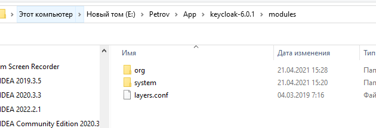
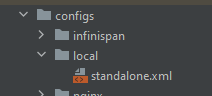
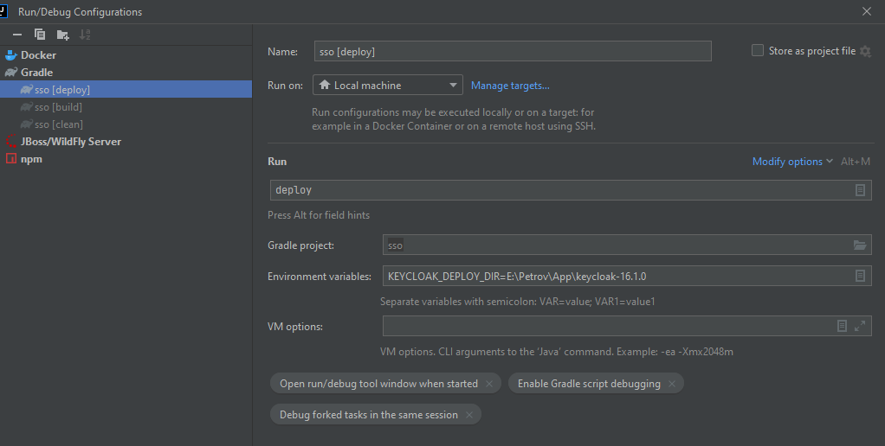
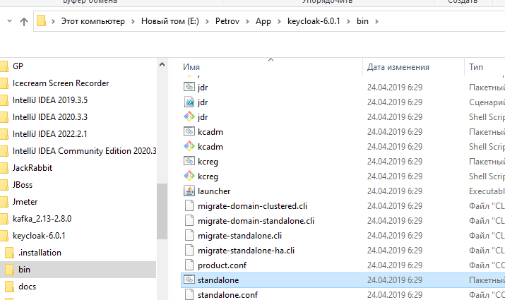
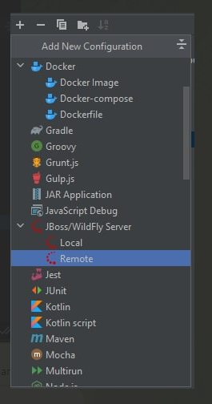
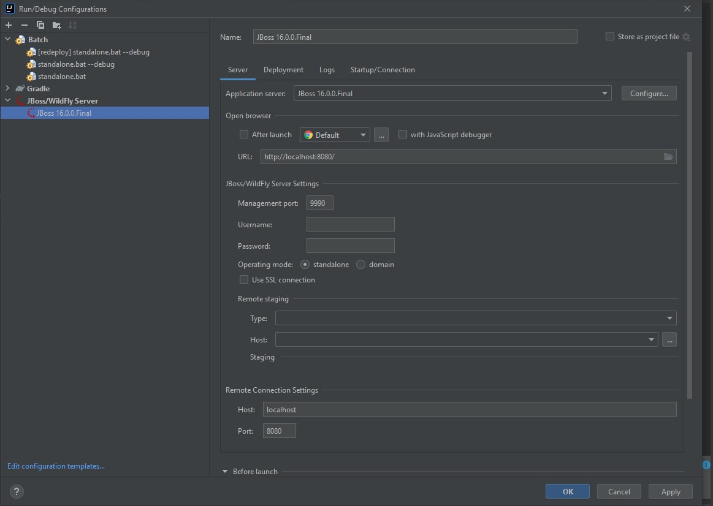
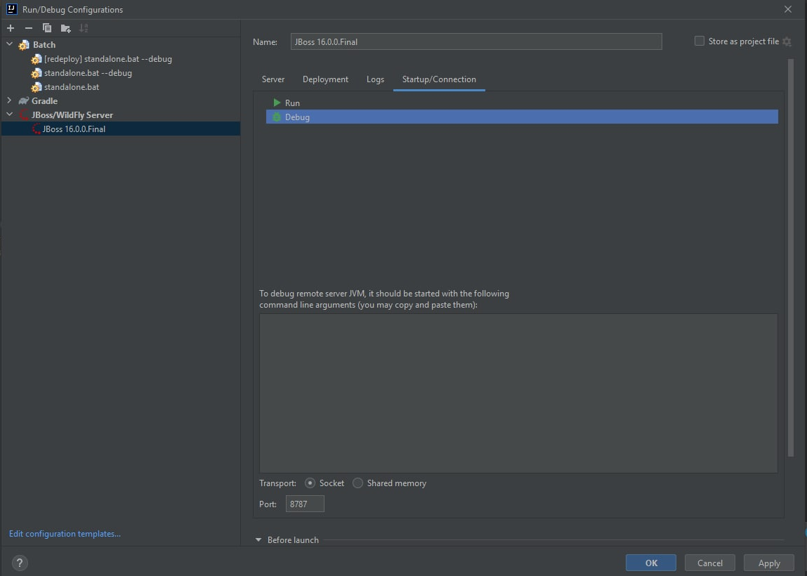
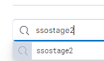
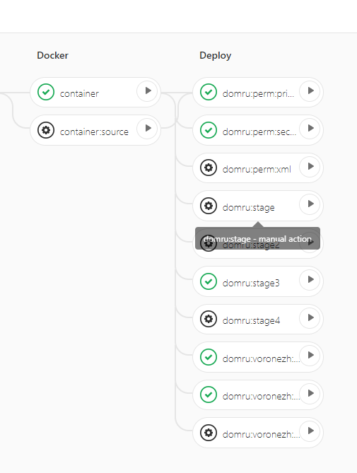
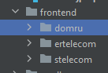

# Проект
https://gitlab.ertelecom.ru/b2bweb/sso

# Поднятие проекта
1) Скачиваем КС 6.0.1 по ссылке https://downloads.jboss.org/keycloak/6.0.1/keycloak-6.0.1.zip
2) Вот этот [файл](org.zip) положить в сам КС в папку modules 
3) Файл [standalone](standalone.xml) вот сюда 
4) Далее настраиваем файл конфигурацию запуска  добавить строку KEYCLOAK_DEPLOY_DIR=C:\keycloak-6.0.1\keycloak-6.0.1.
5) Запуск проекта после Деплоя через этот файл 
6) Сделать проливку данными из какого стейджа

# Запуск проекта с Дебагом
1) Качаем wildFly 16 
2) Настраиваем   
3) Запуск самого приложение с тегом debug т.е. standalone.bat --debug

# Логи стейджей
https://kibana.dev.itrev.ru/app/logs/stream?flyoutOptions=(flyoutId:!n,flyoutVisibility:hidden,surroundingLogsId:!n)&logFilter=(language:kuery,query:ssostage2)&logPosition=(end:now,position:(tiebreaker:1409023,time:1635776220481),start:%272021-11-01T13:17:00.481Z%27,streamLive:!f)
В поле менять на нужный   
Существуют ssostage2, ssostage3, ssostage4, ssostage

# логи прода
Логи прода находятся в менеджерской консоли
https://mgmt1.auth.domru.ru
https://mgmt2.auth.domru.ru

Лучше их просить через Девопса

# Стейджы
1) sso-balancer.testing.srv.loc
2) sso-balancer2.testing.srv.loc
3) sso-balancer3.testing.srv.loc
4) sso-balancer4.testing.srv.loc

# Базы
Тут все БД стейджей
jdbc:mariadb://10.101.6.63:3306/sso2
sso/Okcyetlihoaphho

Прод
jdbc:mariadb://192.168.57.23:3308/sso

# Заливка на прод
Делать нужно с девопсом
1) Смержить свои задачи в PROD ветку
2) Сделать тег
3) В Деплое появятся новые пункты 
4) Нажимаем по очереди с Воронежа
5) В этих кабинетах смотрим что поменялся тег билда
https://mgmt1.auth.domru.ru
https://mgmt2.auth.domru.ru

# Заливка на стейдж
После создание ветки Pipeline собирается автоматически
Ждем первых 3 пункта далее жмем container дожидаемся и заливаем куда нам нужно

# Поднятие фронта
1) Открываем в терминале нужную тему 
2)  npm install      
3) npm run-script build      
4) После каждого изменения фронта билдим фронт деплоим проект

# Ключевые таблицы БД
ADMIN_EVENT_ENTITY - поможет отследить что делал менеджер в админке
APP_PROPERTIES - настройки проекта, разные подключения
AUTO_LOCK_NOTIFICATION - таблица шедулера по предупреждения по долгой не активности
CLIENT - все клиеты для разных реалмов
IMPORT_USERS_DATA
IMPORT_USERS_REPORT - файлы отвечающие за миграцию пользователей
REALM - настройки реалма
USER_ENTITY - все пользователи разных реалмов
USER_POST - таблица кастомеров пользователей
USER_ATTRIBUTE - атрибуты пользователей

# Сервисные письма на email
Изменения производятся в keycloak-extension/src/main/resources/themes/domru/email/html ( см примеры ) - domru

